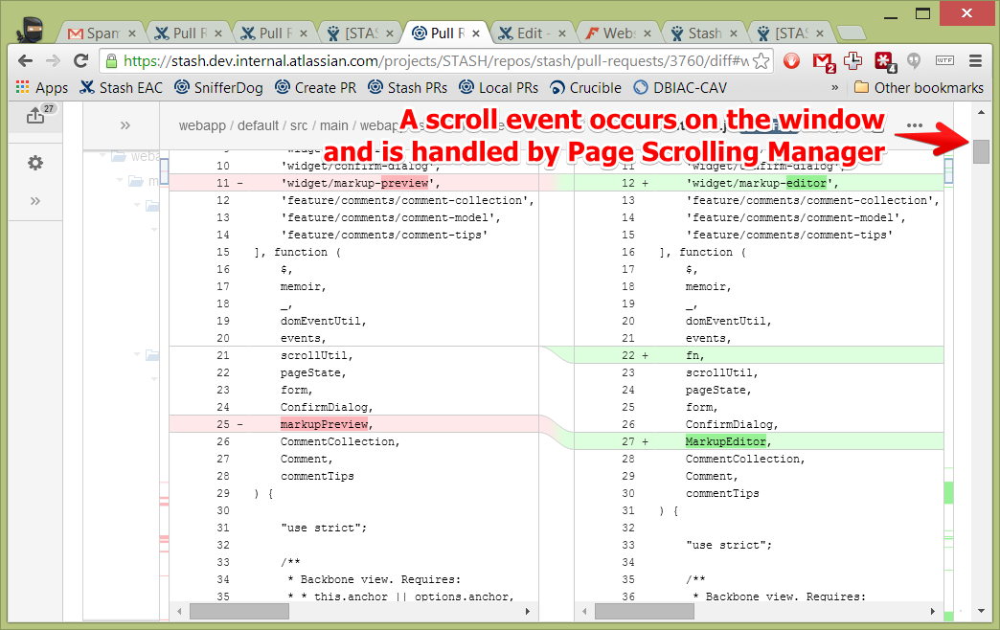
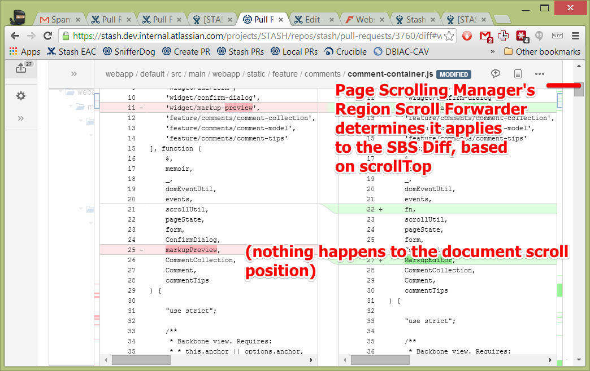
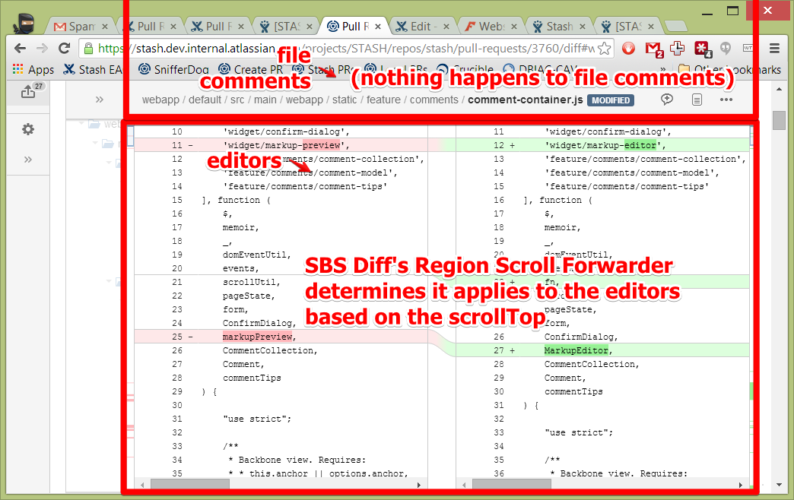
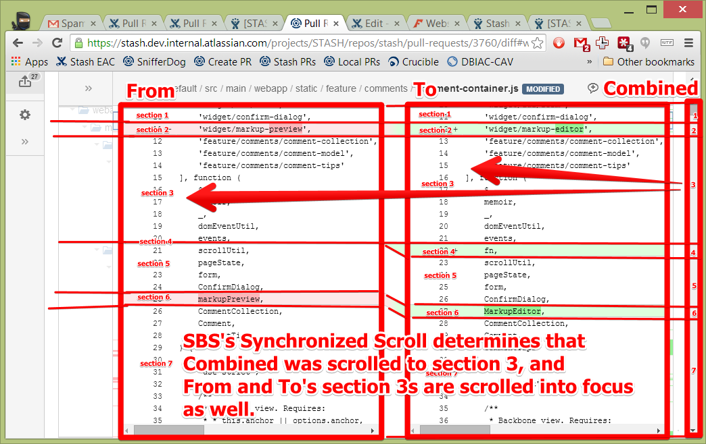

# Scrolling Modules Overview

There are currently three modules in Stash that deal with customized scrolling in JS.

1. Page Scrolling Manager
2. Region Scroll Forwarder
3. Synchronized Scroll

They can generally be thought of as:

- a manager for enabling and disabling custom scrolling at the window level (Page Scrolling Manager),
- a utility to demultiplex/separate scroll events into separate streams, so that each stream receives scroll events that occur within
a certain range of values (Region Scroll Forwarder), and
- a utility to multiplex/combine scroll events from multiple sources
such that a scroll event from any source will be "mirrored" in all the other sources as well using an algorithm that keeps
related sections in each source on-screen at the same time (Synchronized Scroll).

Using the side-by-side diff as an example, here is the path a single scroll event might take:

1. The Page Scrolling Manager is enabled, and linked to the diff view, setting up a chain that will pass scroll events between the two.
2. A scroll event is triggered on the window, and listened for by Page Scrolling Manager.
    
3. The Region Scroll Forwarder used within Page Scrolling Manager decides whether this particular scroll event should be
   applied to the full document, or to the Diff View. It chooses the Diff View based on the value of `scrollTop`.
    
4. The Region Scroll Forwarded used with Diff View decides whether this particular scroll event should be applied to
   the file comments or the CodeMirror editors. It chooses the CodeMirror editors based on the value of `scrollTop`.
    
5. The Synchronized Scroll used within SBS Diff View represents the CodeMirror editors as having three columns - the From
   editor, the To editor, and (to represent scroll events being passed down from the window) a Combined editor that has
   no visible presence on the screen. It receives the window scroll event through the Combined editor, and determines
   which section the Combined editor is currently scrolled to, based on the `scrollTop`. It scrolls the From and To
   editors such that the section in those editors that correspond to the Combined section are also on screen.
    

## Page Scrolling Manager

### Why it exists

This module was created to let us display a native window scrollbar, but have it sized and scrolled and controlled in a
non-standard way. We could determine that a certain part of the page will scroll between points A and B, and another part
of the page would scroll between points B and C.

For example, this allows us to scroll a CodeMirror editor using the native window scrollbar. It allows us to stalk the
file header and only scroll the contents below it.

### Prior art

Diff views in Stash previously would use a 'fixed' mode to get the desired effect of having a window scrollbar scroll
the contents of just one element on the page.

The method was something like this:

- The contents of that element would be fully displayed, without any overflow. The window scrollbar would naturally grow
  with the content.
- A trigger point is marked on the scrollbar where the whole page flips into a 'fixed' mode when the user scrolls down past
  that point. It flips back when the user scrolls back up above it again.
- In 'fixed' mode, some elements are custom-styled to be `position:fixed` and attach themselves to the side or top of the page.
- This creates the appear that only a part of the page is scrolling (the not `fixed` part), where in reality, the whole
  page is scrolling in the background, except for the explicitly `fixed` parts.

The separation of concerns here is that each element that wants to remain fixed on screen must implement two sets of stylings.
One for fixed mode and one for standard mode.
It also requires that the content be available upfront.

#### Pros:

- This method required limited JS interaction. The JS would simply read scroll values and add or remove a class on the body.

#### Cons:

- This method caused a jarring reflow when you scroll past the trigger point in either direction.
- This method required the full amount of content to be visible in the DOM (or a spacer div used to replace the offscreen
  portions of content. This made the DOM very large.
- The content must be natively scrollable - that is, moving the scrollbar _actually_ scrolls the contents.

### How Page-scrolling Manager works

Page Scrolling Manager accepts a single target. This target will receive some of the scroll events from the window, and
can propagate up its own scroll events. The target provides an offset() method. All window scrolls up to `offset().top`
will scroll the document. All scrolls afterwards will be sent to the target. If the target sends a scroll event back up
to the window, Page Scrolling Manager converts it into a scrollTop for the window and moves the scrollbar to that point.

Normally you can't "forward" scroll events from the window. They _all_ are applied to the document. Page Scroll Manager
circumvents this by setting the #page element to be `position:fixed`. Because on an ADG page all the content is under
`#page`, any scrolls of the document aren't applied to it. We then set an explicit height on the `body` so that the
scrollbar can scroll the exact number of pixels that we need it to. This number of pixels is calculated with:

    body height = height of the #page + scrollHeight of the target - height of the target

We "forward" the scrolls by calling a `.scroll()` callback on the target. For any scrolls not "forwarded" we apply them manually
using a `transform:translate()` on `#page` to mimic the real window scrolling. A Region Scroll Forwarder used by Page
Scrolling Manager helps us determine which events should be forwarded and which shouldn't.

Page Scrolling Manager has a different separation of concerns to the earlier method. It requires that the size and position
of the content is known upfront, but the actual content is not needed. The downside to this is that the interface is no longer
a simple DOM element containing the content, but a "target" - a set of user-defined interrelated functions that describe the content.

tl;dr:

- Eagerly switch `#page` to be `position:fixed` and leave it that way for the life of the custom scrolling.
- Mimic native scrolling with `transform: translate` of the `#page` element.
- When native scroll reaches the trigger point, call `target.scroll(y)` to let the target decide how to do the custom scrolling.

#### Pros

- No jarring reflows. JS executes on each scroll event to spread the pain. It only touches one element in the DOM, to lessen
the pain (versus the prior method where the whole DOM was reflowed each time you passed the trigger point).
- No requirement that the content is natively scrollable. This is good for things like CodeMirror where it handles its own
scrollHeight and scrollTop outside of the DOM.

#### Cons

- JS DOM manipulation is really hard to understand and maintain. The size, location, and scroll position of both the
  window and the target must be tracked for calculating the scroll conversions.

### Object shapes

#### Target

The target represents something that will take over the scroll events within a range of the window's scrollTops. It must have methods
for retrieving the scrollHeight, clientHeight, and offset, and for trigger scrolls or resizes as the window is scrolled or resized.
itself.

## Region Scroll Forwarder

This component is used by Page Scrolling Manager (and Diff View) to deal with trigger points. It allows you to define "regions"
of a scrollbar (where trigger points are in between each region), and define local scroll actions within them. Each region
defines its own `getHeight` function (which lets us determine where the trigger points are) and `scroll` function (which is
called whenever we scroll into, out of, across, or within the region). It also has a 'groupId' string. This exists so we
don't take the same action twice when a region is divided.

### Example

Problem: Content within element A should be scrolled when we are above 500px or below 1500px down the page, and content within element
B should be scrolled when we are between 500px and 1500px.

Code:

    var $A = $('#a');
    var $B = $('#b');
    new RegionScrollForwarder(windowScrollBus, [{
        id : 'pre',
        groupId : 'A',
        setScrollTop : function(y) { // will be passed a value between 0 and 500
            $A.scrollTop(y);
        },
        getHeight : function() {
            return 500; // this region starts at 0 and ends at 500px
        }
    }, {
         id : 'in',
         groupId : 'B',
         setScrollTop : function(y) { // will be passed a value between 0 and 1000
             $B.scrollTop(y);
         },
         getHeight : function() {
             return 1000; // + 500 from the first region means this region ends at 1500px
         }
    }, {
         id : 'post',
         groupId : 'A',
         setScrollTop : function(y) { // will be passed a value 0 or greater
             $A.scrollTop(y + 500);
         },
         getHeight : function() {
             return Infinity; // starts at 1500 and goes for as tall as the window can be scrolled.
         }
    }]);

Note there are three regions, and we scroll $A or $B depending on which region is being told to scroll. Note that the first and
third region, since they have the same groupId, will never both be told to scroll for the same scroll event. Only one or the other
will be scrolled. This ensures that we don't call `$A.setScrollTop()` twice.

### Object shapes

#### Region

A region has a height and a method for telling it to scroll. The offset of a region is calculated from the heights of the previous regions.

## Synchronized-Scroll

This utility allows you to jointly scroll multiple elements. Regions of each element's content can be linked to allow you
to vary the scroll speed of each element and ensure that linked regions are onscreen at around the same times.

For example,
suppose you are scrolling elements A, B, and C, which each have a Top and Bottom region of varying sizes:

       Top height | Bottom height | Total height
       -----------------------------------------
    A | 500px     | 50px          | 550px
    B | 100px     | 500px         | 600px
    C | 500px     | 500px         | 1000px

Synchronized scroll will ensure that when you scroll B 100px down, then A will be scrolled about 500px down, and C will be
scrolled about 500px down (so all the corresponding regions match up.

### Algorithms

There are two algorithms used to scroll the sibling columns. The main one `getLinkedScrollTops` is used near the middle
of a scroll, and `proportionalScroll` is used near the edges to ensure that all columns reach the edge at about the same time.
The two algorithms are weighted

#### getLinkedScrollTops

This algorithm:

1. Finds the region that is "in focus". We arbitrarily say that the region that contains the pixel 20% of the
way down the viewport is the one in focus.
2. Determines the proportion of it that is above or below that focus line.
3. Finds the sibling/linked regions for it in the other columns.
4. Determines what `scrollTop` value for each of the sibling columns would make the linked regions appear proportionally
   the same amount past the focus line. For example if B is scrolled such that the Top region is 60% past the focus line
   (so 60px are above the line, and 40px are below), then A and C will be scrolled so their top regions are also 60% past
   the focus line (300px above and 200px below).

#### proportionalScroll

This algorithm is specific to either the top or bottom edge of the scrollable elements. For a particular edge (top or bottom),
it:

1. Determines what the last scroll position and current scroll position of the scrolled element are.
2. Finds the proportion of the distance to the edge that has changed. E.g. if we were 100px from the edge and now are 50px,
   from the edge, we have scrolled 50% of the way to the edge.
3. Finds the current scroll position of the sibling elements, and scrolls them an equivalent proportion.

E.g. if B was at 100px from the top and now is at 60px from the top, it scrolled 40% closer. If A is currently at 300px,
it will be scrolled 40% closer to the top, or 120px up to become 180px from the top.

A similar scroll position will be calculated for distances from the bottom edge as well.

#### Weightings

The algorithms are weighted such that when you are at the top edge, only the `proportionalScroll` algorithm's result is
used and only relative to the top edge. When you are at least half a viewport away from the edge, only the
`getLinkedScrollTops` algorithm is used. A squared weighting is used between those distances, such that exponentially
more of the `proportionalScroll` algorithm's result is used as you move closer to an edge.

### Object shapes

#### Scrollable

A Scrollable is one of the sibling scrollable elements to be scrolled in unison. It has a method for getting information about
scrollTop/Left, scrollHeight/Width, and clientHeight/Width, a method for telling the scrollable to scroll, and a method
for tracking whether the last scroll event received by the scrollable came from our Synchronized Scroll code (`getAndUnsetProgrammaticScrollMarker`).

#### Region

Regions describe an area of the Scrollable's content that can be linked to areas in the sibling Scrollables. They have
methods for determining their offset and height within the Scrollable.

#### CodeMirrorScrollable (implements Scrollable)

An implementation of Scrollable that represents a CodeMirror editor.

#### UnbackedScrollable (implements Scrollable)

Used for the "Combined" column in SBS diff, this is an in-memory implementation of a scrollable that tracks the position
of the window's scrollbar (notable only during the period where the window scrollbar is actually scrolling the editors).
Any programmatic scrolls from Synchronized Scroll are forwarded up to the Page Scrolling Manager and the window. Any scroll
events from the window are triggered internally to cause the CodeMirrorScrollables to match it.

#### CodeMirrorRegion (implements Region)

A diff segment within the editor. This will be linked with either a matching segment in the other editor (e.g. ADDED after
REMOVED means the ADDED and REMOVED segments each be a CodeMirrorRegion and will link together), or a 0-height Region
if there is no actually sibling for it to match in the other editor. These will also link to a CombinedRegion

#### CombinedRegion (implements Region)

This represents how the window scrollbar should move, relative to the segments in each of the editors. The height of a CombinedRegion
is simply the maximum height of linked From and To regions.